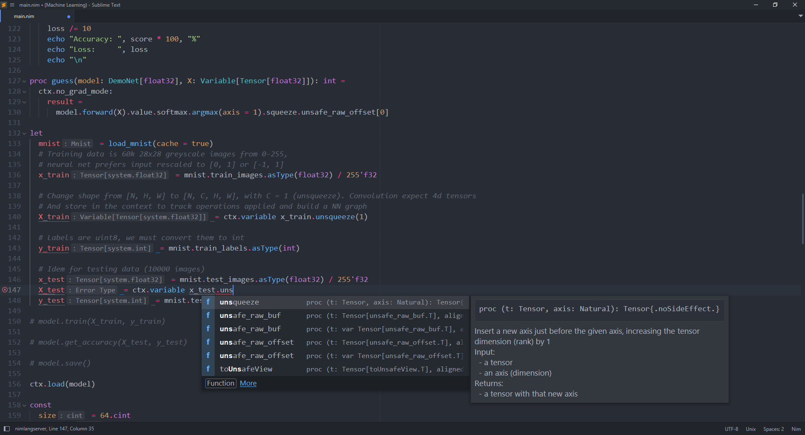
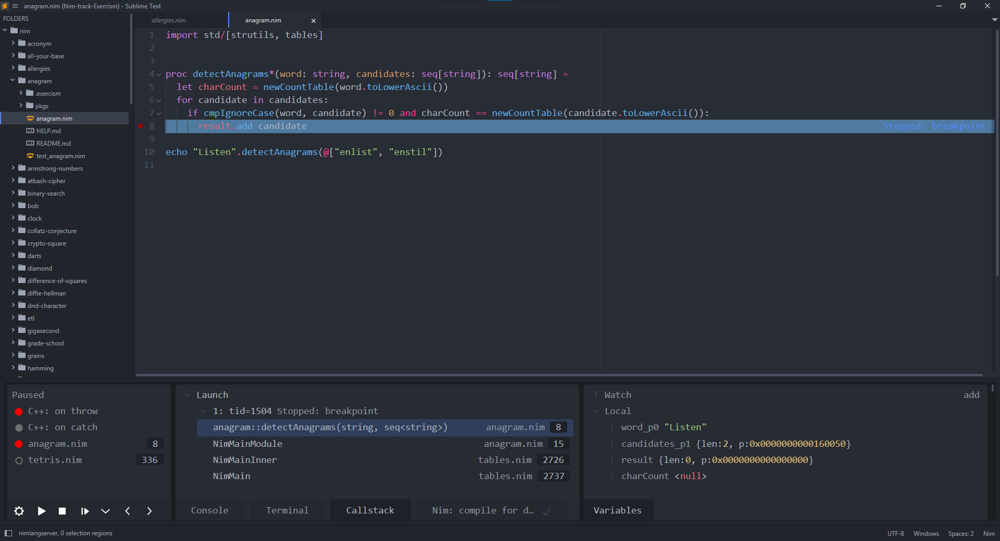

# LSP-nimlangserver

A helper package that manages the [nimlangserver](https://github.com/nim-lang/langserver) language server.



## Installation

Install the following packages via Package Control:
1. [LSP](https://packagecontrol.io/packages/LSP)
2. [LSP-nimlangserver](https://packagecontrol.io/packages/LSP-nimlangserver)
3. [NimLime](https://packagecontrol.io/packages/NimLime)
4. [Debugger](https://packagecontrol.io/packages/Debugger) for Debugging Nim programs.
5. [Terminus](https://packagecontrol.io/packages/Terminus) for running debugger tasks.

## Configuration

You can edit the global settings by opening the `Preferences: LSP-nimlangserver Settings` from the Command Palette.

You can also have a project-specific configuration. Run the `Project: Edit Project` from the Command Palette and edit the following in the `settings` object.

```js
{
    // folders: [
    //   ...
    // ]
    "settings": {
        "LSP": {
            "nimlangserver": {
                "settings": {
                    //Setting-here
                }
            }
        }
    }
}
```

## Applicable Selectors

This language server operates on views with the `source.nim` base scope.

## Server Management

If the `"binary"` setting is set to a non-empty string (the default), then it
will try to find the server binary in your system.
If it fails, then it will prompt you to download it from Github.
The server binary is automatically downloaded to `$CACHE/Package Storage/LSP-nimlangserver`.

## Debugging

The [Debugger](https://packagecontrol.io/packages/Debugger) package enables debugging Nim programs (among others). Some setup is required however.



#### Setting Up

* Read the [README](https://github.com/daveleroy/SublimeDebugger?tab=readme-ov-file#sublime-debugger)
* The adapter to install is lldb.
* Example configurations for debugging the current file:

```js
{
    // folders: [
    //   ...
    // ]
    "debugger_configurations":
    [
        {
            "name": "Launch",
            "program": "${file_path}/${file_base_name}",
            "pre_debug_task": "Nim: compile for debugging",
            // "preRunCommands": ["command script import --allow-reload \"<PATH_TO_NIM_INSTALLATION_DIR>/tools/debug/nimlldb.py\""] // improves values representation (but may be buggy).
            "args": [],
            "cwd": "${file_path}"
        },
    ],
    "debugger_tasks": [
        {
            "name": "Nim: compile for debugging",
            "shell_cmd": "nim c -g ${file}",
            "file_regex": "^(.+.nim)\\((\\d+), (\\d+)\\) (.*)",
            "line_regex": "Error:"
        }
    ]
}
```

* You may also define tasks and configurations globally:
    * Run `Preferences: Debugger Settings` from the command palette.
    * Add the task or configuration to the `global_debugger_tasks` or the `global_debugger_configuration` settings respectively.
